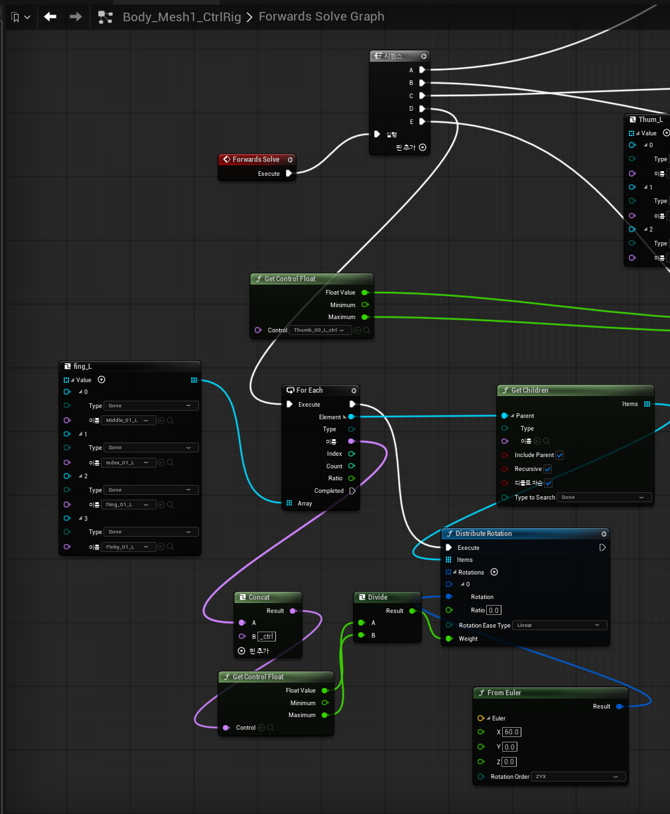
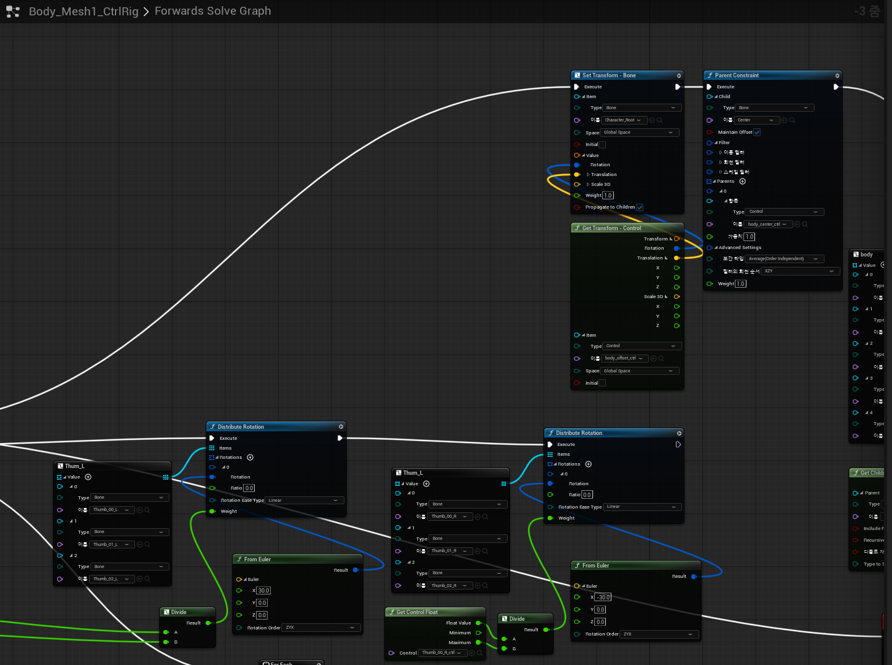
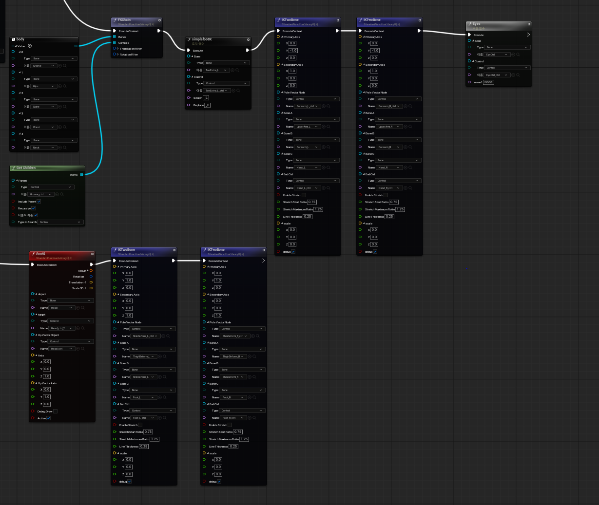

# 🎮 캐릭터 컨트롤 리그 노드 명세 (Character Control Rig Graph)

본 문서의 프로젝트의 캐릭터 리깅 자동화 및 포워드/인버스 키네마틱스(FK/IK) 제어를 위한 **Unreal Engine Control Rig (Forwards Solve Graph)**의 핵심 노드 구조를 설명합니다.

---

## 📌 목차
1. [전체 실행 흐름 (Sequence & Execution)](#1-전체-실행-흐름-sequence--execution)
2. [손가락 회전 제어 및 분산 시스템 (Finger Rotation Distribute)](#2-손가락-회전-제어-및-분산-시스템-finger-rotation-distribute)
3. [신체 FK 체인 및 발 IK 세팅 (Body FK & Foot IK)](#3-신체-fk-체인-및-발-ik-세팅-body-fk--foot-ik)
4. [상/하체 및 시선 제어 (IK Two Bone & AimAt)](#4-상하체-및-시선-제어-ik-two-bone--aimat)

---

## 1. 전체 실행 흐름 (Sequence & Execution)
`Forwards Solve` 이벤트를 시작으로 시퀀스(Sequence) 노드를 통해 각 부위별 리깅 로직이 순차적으로 실행됩니다.

* **주요 기능:** 실행 순서 제어 및 컨트롤러 데이터 추출 기반 다중 루프 처리
* **파일 위치:** `images/node/2567.PNG`

> **핵심 로직 요약:**
> * `Forwards Solve` 호출 후 시퀀스 분기 실행
> * `ForEach` 노드와 `Concat` 노드를 활용해 다수의 손가락 컨트롤러(`fing_L` 배열 등) 이름을 동적으로 결합하고 순회(Loop) 처리

---

## 2. 손가락 회전 제어 및 분산 시스템 (Finger Rotation Distribute)
엄지(`Thumb`) 및 기타 손가락들의 자연스러운 굽힘을 구현하기 위해 단일 컨트롤러 입력값을 기반으로 다중 관절의 회전 값을 분산 처리합니다.

* **주요 기능:** 컨트롤러 축 값 분할, `Distribute Rotation`을 이용한 관절 순차 회전
* **파일 위치:** `images/node/CharacterNode/6767.PNG`

> **핵심 로직 요약:**
> * `Get Control Float`으로 컨트롤러의 특정 축 입력값을 가져옴
> * `Divide` 노드를 거쳐 회전각을 감쇄시킨 뒤, `From Euler` 노드를 통해 회전 데이터 변환
> * `Distribute Rotation` 노드를 통해 `Thumb_00`, `Thumb_01`, `Thumb_02` 등의 뼈에 자연스러운 곡선 형태로 회전을 배분

---

## 3. 신체 FK 체인 및 발 IK 세팅 (Body FK & Foot IK)
루트(Groove/Hips)부터 척추, 목으로 이어지는 순방향 키네마틱스(FK)와 지형 적응 및 안정적인 배치를 위한 발(Foot) 리깅 시스템입니다.

* **주요 기능:** 주요 척추 라인 FK 제어 및 단순화된 발 IK 연산
* **파일 위치:** `images/node/35357.PNG` (또는 `4225.PNG`)

> **핵심 로직 요약:**
> * `body` 변수 구조체(`Groove`, `Hips`, `Spine`, `Chest`, `Neck`)를 `FKChain` 노드에 전달하여 상체 움직임 연동
> * `simplefootIK` 커스텀/로컬 함수 노드를 통해 좌우 발 관절 및 토(Toe) 컨트롤러 매핑 최적화

---

## 4. 상/하체 및 시선 제어 (IK Two Bone & AimAt)
팔(Arm)과 다리(Leg)의 안정적인 굽힘을 위한 `IKTwoBone` 솔버와 타겟을 바라보게 만드는 `AimAt` 및 시선 제어 로직입니다.

* **주요 기능:** 사지(Extremities)의 2본 IK 솔버 적용, 헤드 추적(LookAt) 및 시선 연동
* **파일 위치:** `images/node/4225.PNG` (또는 `35357.PNG`)

> **핵심 로직 요약:**
> * **사지 IK:** >   * 팔(`UpperArm`, `Forearm`, `Hand`) 및 다리(`ThighDeform`, `ShinDeform`, `Foot`)에 각각 `IKTwoBone` 세팅
>   * `Pole Vector Node` 지정을 통해 무릎과 팔꿈치가 꺾이는 방향(힌지 축)을 컨트롤러로 제어
> * **시선 & 헤드:** >   * `AimAt` 노드를 사용하여 머리(`Head`) 본이 타겟 컨트롤러를 자연스럽게 조준하도록 구성
>   * 최상단 우측 `Eyes` 로컬 함수를 통해 눈동자(`EyeCtrl`)의 독립적인 움직임 보정
