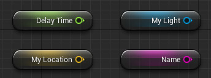
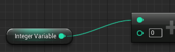
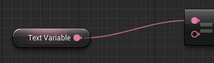
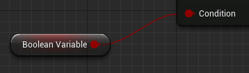
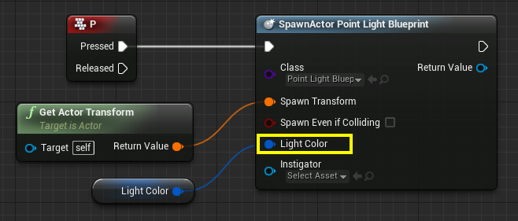

블루프린트는 C++으로 미리 만들어진 함수를 노드화 한것
블루프린트의 종류중 변수 노드와 제어 노드, FK,IK, ControlNet, 그외 함수문이 노드 형태로 존재함 
노드와 노드끼리 연결하는 방법으로 상태값을 정의함

Boolean	빨강	빨강 변수는 부울 (True / False) 데이터를 나타냅니다.
Integer	청록	청록 변수는 0, 152, -226 와 같은 정수 데이터, 또는 소수점이 없는 숫자를 나타냅니다.
Float	초록	초록 변수는 0.0553, 101.2887, -78.322 와 같은 실수 데이터, 또는 소수점이 있는 숫자를 나타냅니다.
String	자홍	자홍 변수는 Hello World 와 같은 문자열 데이터, 또는 알파벳과 숫자로 된 글자 그룹을 나타냅니다.
Text	분홍	분홍 변수는 표시되는 텍스트, 특히나 현지화가 가능한 텍스트를 나타냅니다.
Vector	금색	금색 변수는 벡터 데이터, 또는 XYZ 나 RGB 처럼 세 개의 실수로 구성되는 요소나 축 정보를 나타냅니다.
Rotator	보라	보라 변수는 3D 공간에서의 회전을 수치로 정의하는 그룹인 로테이터 데이터를 나타냅니다.
Transform	주황	주황 변수는 트랜슬레이션 (3D 위치), 로테이션, 스케일로 구성되는 트랜스폼 데이터를 나타냅니다.
Object	파랑	파랑 변수는 오브젝트, 즉 라이트, 액터, 스태틱 메시, 카메라, 사운드 큐 등을 나타냅니다.

또한 스폰시 노출, 퍼블릭,프라이빗 변수, 시네마틱에 노출등이 존재하고 
스폰시 노출은 특정 상황에 객체의 상태값을 넣어 변수를 만들고 시네마틱은 말 그대로 컷신이나 상태의 변화를 만들때 사용하는 애니메이션 기능

