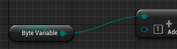
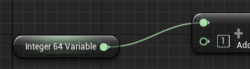
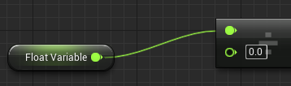
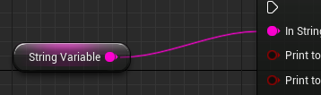
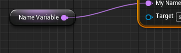
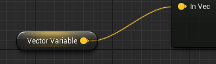
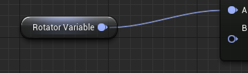
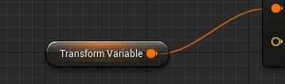
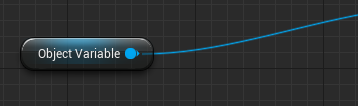

# 1장. 언리얼 엔진 블루프린트 핵심 요약

## 1. 블루프린트의 본질
블루프린트는 **C++로 미리 만들어진 함수와 클래스를 비주얼 스크립팅 환경에 맞게 노드화(Node)한 시각적 언어**입니다. 
블루프린트 환경 안에서는 변수 노드와 제어 노드, 그리고 애니메이션 제어를 위한 FK, IK, 컨트롤 릭(Control Rig) 및 무수한 함수문들이 노드 형태로 존재하며, 이 노드와 노드끼리 와이어를 연결하여 객체의 논리적 흐름과 상태값을 정의하게 됩니다.

---

## 2. 변수 데이터 타입 및 와이어 색상 가이드

노드 간 연결 시 흘러가는 데이터의 종류는 와이어와 핀의 고유한 색상으로 명확히 구분됩니다.

| 데이터 타입 (Type) | 대표 색상 | 상세 설명 |
| :--- | :--- | :--- |
| **Boolean** |  빨강 | 부울 (True / False) 이진 데이터를 나타냅니다. |
| **Integer** |  청록 | 0, 152, -226과 같은 정수 데이터(소수점이 없는 숫자)를 나타냅니다. |
| **Float / Real** |  초록 | 0.0553, 101.2887과 같은 실수 데이터(소수점이 있는 숫자)를 나타냅니다. |
| **String** |  자홍 | 'Hello World'와 같은 문자열 데이터, 또는 알파벳과 숫자로 된 글자 그룹을 나타냅니다. |
| **Text** |  분홍 | 사용자 화면에 표시되는 텍스트, 특히 국가별 다국어 번역(현지화)이 가능한 데이터를 나타냅니다. |
| **Vector** |  금색 | XYZ 좌표나 RGB 컬러처럼 세 개의 실수 세트로 구성되는 요소나 축 정보를 나타냅니다. |
| **Rotator** |  보라 | 3D 공간에서의 회전(Pitch, Yaw, Roll)을 수치로 정의하는 그룹 데이터를 나타냅니다. |
| **Transform** |  주황 | 트랜슬레이션(3D 위치), 로테이션(회전), 스케일(크기)을 모두 합친 종합 데이터를 나타냅니다. |
| **Object** |  파랑 | 라이트, 액터, 스태틱 메시, 카메라 등 게임 월드 내 오브젝트 자체를 통째로 가리킵니다. |

---

## 3. 고급 변수 속성 및 노출 옵션

블루프린트 변수는 접근 권한 및 특정 시스템과의 연동을 위해 다양한 특성(Property) 설정을 지원합니다.

*   **인스턴스 편집 가능 (Public / Private):** 변수의 공개 범위를 설정합니다. 퍼블릭(Public)으로 설정 시 외부의 다른 블루프린트나 에디터 디테일 창에서 이 변수값을 직접 수정할 수 있습니다.
*   **스폰 시 노출 (Expose on Spawn):** 객체가 월드에 생성(Spawn)되는 특정 상황에서, **생성과 동시에 원하는 상태값을 주입**하여 변수를 초기화 상태로 태어나게 만드는 기능입니다. 생성 직후 데이터 공백으로 인한 버그를 방지합니다.
*   **시네마틱에 노출 (Expose to Cinematics):** 변수 값이 언리얼 엔진의 영상 편집기인 **시퀀서(Sequencer) 타임라인의 영향을 받도록 허락**하는 기능입니다. 개발자가 코딩을 하지 않고도 시간선에 키프레임을 찍어 문이 부드럽게 열리거나 불빛이 어두워지는 애니메이션 연출을 제어할 수 있습니다.
