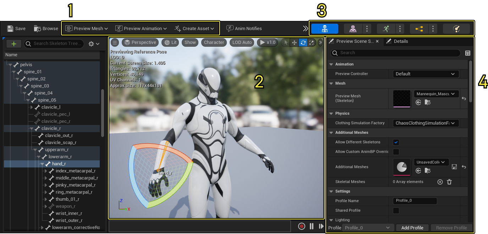
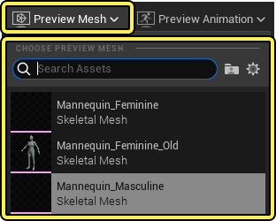
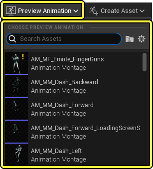
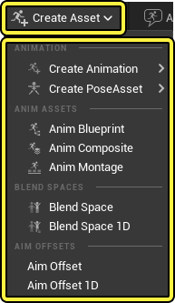

먼저 애니메이션 에디터 창에 대해 알아보겠습니다
1번은 툴바, 2번은 뷰포트, 3번은 에디터 모드 4번은 프리뷰 세팅 즉 색이나 콜라이더같은 물리제어를 체크하는곳

툴바에서는 프리뷰 메시, 프리뷰 애니메이션 크리에이트 애니메이션이 존재하는데 
프리뷰 메시에서는 사용자가 지정한 마네킹 뼈대에 붙여 어떻게 보이는지 특히 그림자나 그런 살 뭉개짐이 없는지 확인할때 자주 사용,
프리뷰 애니메이션은 사용자가 만들어놓은 애니메이션을 화면에서 보이게 함으로서 이상한점이 없는지 디버깅 하기 위함 

애니메이션을 만들기위한 핵심 크리에이트 애니메이션 기능

기본 뼈대 및 리포팅 툴{
크리에이트 애니메이션: 뼈를 움직이다가 맘에 드는 포즈가 나오면 해당 애니메이션을 저장하는 용도
크리에이트 포즈 에셋: 손가락이나 표정등 복잡한 애니메이션 변형 규칙을 저장하는 파일 
애님 블루프린트: 애니메이션 전용 두뇌를 만드는것과 같음 플레이어가 가만히 있을떄,움직일떄, 달릴떄 각 상황마다 애니메이션 재생 규칙과 조건을 걸음 
}
특수 애니메이션{
    애닛 컴포짓: 

}

